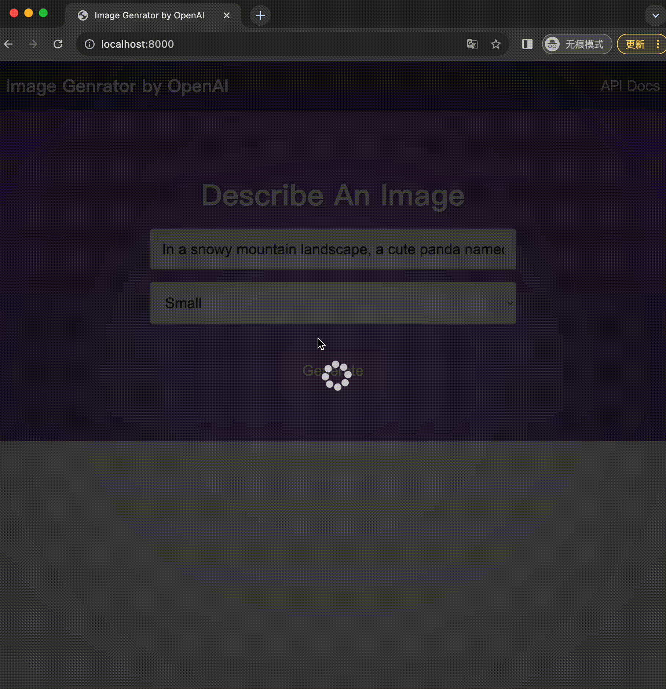

# nodejs-image-generator
This web application that utilizes Node.js and OpenAI to produce images



## Usage

Rename the `example.env` file to `.env`.

Generate an API KEY at [OpenAI](https://beta.openai.com/) and add it to the `.env` file.

Install the dependencies

```bash
npm install
```

Run server

```bash
npm start
```

Visit `http://localhost:8000` in your browser.

The endpoint is at `POST http://localhost:8000/openai/generateimage`.